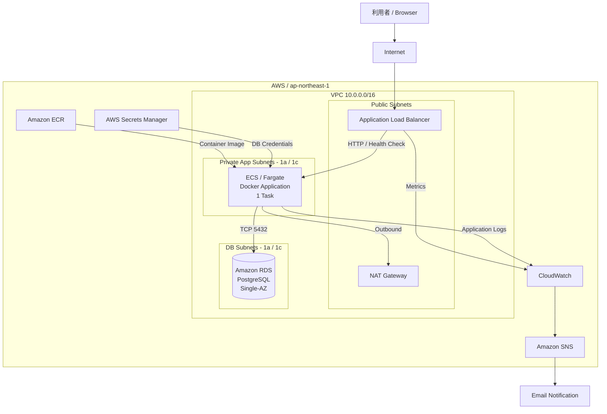

# aws-infrastructure-portfolio

## 概要

複数拠点を持つ中小企業の「設備・障害・点検管理Webサービス」を想定し、AWS上にインフラ環境を設計・構築したポートフォリオです。

単にAWSリソースを作成するだけではなく、要件整理、ネットワーク設計、コンテナ実行環境、データベース、監視・通知、IaC、CI、障害試験・復旧までを一連のインフラ構築業務として実施しました。

## 検証ステータス

本ポートフォリオはAWS上へ実際に構築し、正常系・障害系の検証を完了しています。

最終確認では、Terraformと実環境に差分がないこと、ECS/Fargateが `Running: 1 / Desired: 1` で稼働していること、ALB Targetが `healthy` であること、RDSが `available` かつ暗号化・非公開設定であること、CloudWatch Alarmが正常状態であること、`/health` がHTTP 200を返すことを確認しました。

検証完了後は継続課金を避けるため `terraform destroy` を実施し、Terraform stateが空であることに加えて、NAT Gateway、Elastic IP、EC2、RDS、ALB、ECS Cluster、ECRが残っていないことをAWS CLIで確認しています。
## 想定要件

想定企業の主な要件は以下です。

* 社員約120名、将来的に約200名
* 最大同時利用者：約50名
* 本社および3工場からWebサービスを利用
* 初期段階では社外からのアクセスなし
* 平日7:00〜20:00を主な利用時間とする
* IT担当者2名で運用
* 24時間有人監視は行わない
* 重大障害のRTO（目標復旧時間）：4時間
* RPO（目標復旧時点）：24時間
* DBをインターネットへ直接公開しない
* 異常発生時に通知できること
* ログを保存し、障害原因を調査できること
* IaC（Infrastructure as Code：インフラ構成のコード管理）によって環境を再現できること

## AWS構成



ALBはPublic Subnetに配置し、ECS/FargateタスクはPublic IPを持たないPrivate App Subnetで実行しています。アプリケーションから外部AWSサービスなどへの通信はNAT Gatewayを経由します。

検証時はALBをPublic ALBとして構築し、HTTP/80へのアクセス元をTerraform変数 `allowed_ipv4_cidr` で指定した検証元IPv4アドレス（/32）のみに制限しました。`0.0.0.0/0` からのHTTPアクセスは許可していません。

想定要件の「初期段階では社外アクセスなし」を本番環境で満たす場合は、社内ネットワークとAWSをSite-to-Site VPN等で接続し、Internal ALBを利用する構成を検討します。今回の検証では独自ドメインを取得せずHTTPを使用したため、本番化時には独自ドメイン、ACM証明書、HTTPS Listenerを構成し、HTTPからHTTPSへのリダイレクトを実装する方針です。

RDSはDB Subnet Group内に配置し、`publicly_accessible = false` としています。Security GroupではECSからPostgreSQLのTCP/5432への通信のみを許可しています。

現在のポートフォリオ環境ではコストを考慮し、RDSはSingle-AZ、ECSは通常1タスクで構成しています。一方、サブネットはap-northeast-1a / 1cの2AZへ分離し、将来的な冗長化やスケール構成へ拡張できるネットワーク構成としています。

## 使用技術

| 分類              | 技術・サービス                                     | 用途                    |
| --------------- | ------------------------------------------- | --------------------- |
| Cloud           | AWS                                         | インフラ実行基盤              |
| Network         | VPC / Subnet / NAT Gateway / Security Group | ネットワーク分離・通信制御         |
| Load Balancer   | Application Load Balancer                   | HTTPアクセスの受付・ヘルスチェック   |
| Container       | ECS / Fargate                               | Dockerコンテナの実行         |
| Database        | Amazon RDS for PostgreSQL                   | アプリケーションデータ保存         |
| Registry         | Amazon ECR                                   | Dockerイメージの保存          |
| Secrets          | AWS Secrets Manager                       | RDS認証情報の管理             |
| Monitoring      | Amazon CloudWatch                           | ログ・メトリクス・アラーム         |
| Notification    | Amazon SNS                                  | 障害通知                  |
| IaC             | Terraform                                   | AWSインフラのコード化・再構築      |
| Container       | Docker                                      | アプリケーションのコンテナ化        |
| CI              | GitHub Actions                              | push時のDockerイメージビルド確認 |
| Version Control | Git / GitHub                                | ソースコード・構成管理           |

## 設計上のポイント

### ネットワーク分離

ALB、ECS、RDSの役割に応じてSecurity Groupを分離しました。

特にRDSではインターネットからの直接接続を許可せず、ECSのSecurity GroupからTCP/5432への通信のみを許可しています。

### セキュリティ

ALB、ECS、RDSごとにSecurity Groupを分離し、必要な通信経路のみを許可しました。

* ALB → ECS：TCP/8000
* ECS → RDS：TCP/5432
* RDS：`publicly_accessible = false`
* ECS/Fargate：Public IPを付与しない
* RDS認証情報：Secrets ManagerからECSタスクへ注入
* ALB HTTP：検証元IPv4アドレス（/32）のみに制限

検証途中ではALBのHTTP/80が `0.0.0.0/0` に公開されていること、およびHTTPS Listener未実装にもかかわらず443番ポートのIngressルールが存在することを最終レビューで発見しました。HTTPのアクセス元を検証元IPv4アドレスのみに変更し、未使用の443番ルールを削除した上で、`/health` がHTTP 200を返すことを再確認しました。
### コンテナ実行環境

アプリケーション実行基盤にはECS/Fargateを採用しました。

EC2インスタンス自体の管理を不要にし、コンテナ単位でアプリケーションを実行できる構成としています。

### IaC

AWSリソースはTerraformで管理しています。

手動変更によってAWS環境とTerraformコードに差分が発生した場合も、`terraform plan` によってドリフト（実環境とコードとの差分）を確認し、コードで定義した状態へ復旧できることを障害試験で確認しました。

### 監視・通知

CloudWatchによってアプリケーションログとALBの状態を確認できるようにし、CloudWatch AlarmとSNSを利用して異常をメール通知できる構成としました。

### CI

GitHub Actionsを利用し、GitHubへのpushを契機としてDockerイメージをビルドするCI（Continuous Integration：継続的インテグレーション）を構築しました。

これにより、Dockerfileやアプリケーションの変更後にコンテナイメージを正常に作成できるか自動確認できます。


## 障害試験：RDS接続障害と復旧

### 目的

ECS上のアプリケーションからRDSへの通信障害を意図的に発生させ、障害発生時の挙動、ログによる原因調査、Terraformによる復旧手順を確認した。

### 障害の再現

RDSのSecurity Groupから、ECSのSecurity Groupを送信元とするTCP/5432のIngressルールを一時的に削除した。

これにより以下の通信を遮断した。

```text
ECS (Fargate)
    ↓
TCP/5432
    ×
RDS (PostgreSQL)
```

### 発生した事象

障害発生後、ALB経由で `/health` にアクセスしたところ、HTTP 504 Gateway Timeoutが発生した。

CloudWatch Logsを確認したところ、以下の事象を確認した。

* Gunicornで `WORKER TIMEOUT` が発生
* `/health` 内のDB接続処理で停止
* `psycopg.OperationalError` によるPostgreSQL接続失敗
* Gunicorn Workerが起動できず終了
* ECSサービスが `Desired: 1` に対して `Running: 0` となった

これにより、RDSへの接続障害がアプリケーションの正常性に影響していることをログから特定した。

### 復旧

Terraformを実行したところ、手動削除したSecurity Groupルールとの差分を検知した。

```text
Plan: 1 to add, 0 to change, 0 to destroy.
```

`terraform apply` により、ECSからRDSへのTCP/5432通信ルールを再作成した。

その後、ECSサービスに対して新しいデプロイを実行し、タスクを再起動した。

復旧後のECSサービス：

```text
Running: 1
Desired: 1
Pending: 0
```

最終的に `/health` を再確認し、以下の応答を確認した。

```text
HTTP Status: 200
{"database":"ok","status":"ok"}
```

### 結果

障害の発生から原因調査、IaC（Infrastructure as Code：インフラ構成のコード管理）による設定復旧、ECSサービスの復旧、アプリケーションとDBの正常性確認までの一連の障害対応を実施できた。

また、DB接続障害時にアプリケーションの起動自体が失敗する設計上の課題も確認できたため、今後の改善点としてDB接続タイムアウトや起動処理の分離を検討する。
## 今回の判断と今後の改善

本ポートフォリオでは、想定企業の規模と検証コストを考慮して、RDSはSingle-AZ、ECSは1タスクとしました。サブネットは2AZへ分離しているため、本番化時にはRDS Multi-AZやECS複数タスクへの拡張を検討できます。

また、今回のGitHub ActionsはDockerイメージをビルドできることを確認するCIまでを対象としており、AWS環境への自動デプロイ（CD）は実装していません。

本番化する場合の主な改善候補は、以下です。

* 独自ドメイン + ACM + ALB HTTPS Listener + HTTP→HTTPSリダイレクト
* Site-to-Site VPN等を利用した社内ネットワークからのアクセス
* ECS Service Auto Scaling / Scheduled Scaling
* RDS Multi-AZ
* アプリケーションの認証・認可
* DB障害時の接続タイムアウト、リトライ、起動処理の分離
* GitHub ActionsからECR/ECSへのCD
* 必要に応じたVPC Endpoint導入とOutbound通信のさらなる制限

未実装項目を単に追加するのではなく、可用性、セキュリティ、運用負荷、コストの要件に応じて採用を判断する方針としています。

## 検証環境の終了

正常系・障害系・セキュリティ修正後の動作確認と証跡取得を完了した後、AWSリソースは `terraform destroy` で削除しました。

削除後に `terraform state list` が空であることを確認し、さらにAWS CLIでNAT Gateway、Elastic IP、EC2、RDS、ALB、ECS Cluster、ECRが残っていないことを確認しました。

TerraformコードはGitHubに残しているため、必要な変数を設定して再度 `terraform apply` することで環境を再構築できます。
